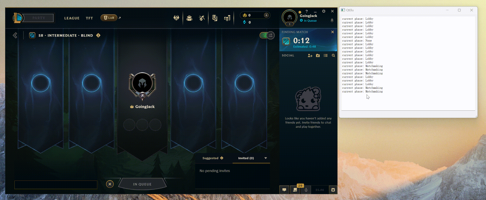

# QtElu

[English](README.md)

QtElu 是一个轻量级的开源英雄联盟助手工具，可以帮助自动接受对局。

## 使用方法

在英雄联盟客户端运行时启动应用程序即可。当找到对局时，QtElu 将自动为您接受。

## 功能特点

- 自动接受对局匹配
- 轻量级实现，依赖项最小化，确保低内存和CPU使用率
- 无复杂界面，专注于简单高效
- 使用 Riot Games 官方 API
- 安全且符合游戏政策，但用户需自行承担使用风险

## 为什么选择 QtElu？

- **轻量级**：最小化资源占用
- **简单**：专注核心功能，没有多余特性
- **安全**：使用 Riot Games 官方 API 构建
- **开源**：代码透明，可自由使用和修改

## 技术细节

- 使用 Qt 框架构建
- 使用 Riot Games LCU API
- 不修改游戏文件，仅依赖官方 API
- 整洁可维护的代码库，便于定制和贡献

## 安全性

该工具仅使用 Riot Games 官方 API 接口，不会修改任何游戏文件。但用户仍应注意使用第三方工具可能带来的风险。

## 贡献

欢迎通过提交问题或拉取请求为该项目做出贡献。

## 许可证

本项目采用 MIT 许可证开源。

## 免责声明

QtElu 是一个独立项目，未与 Riot Games 有任何关联或得到其认可。
